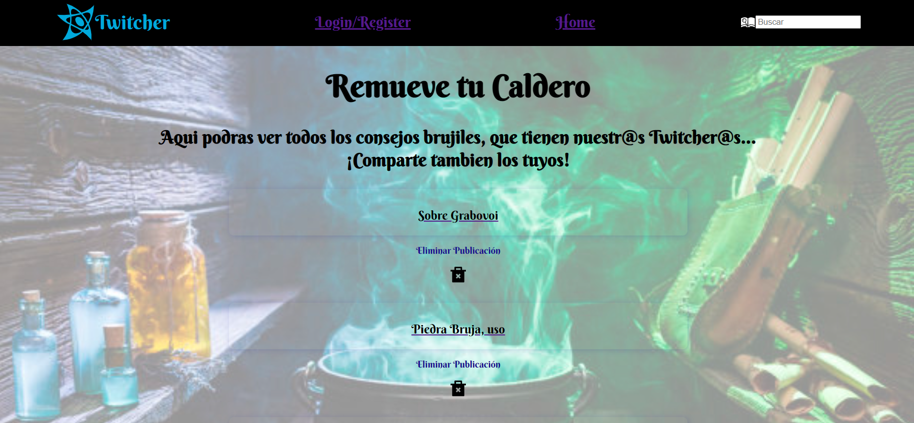
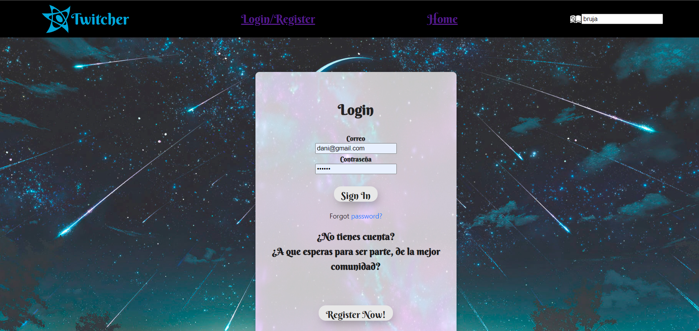

## Sobre el proyecto

En este proyecto se unifica todo lo aprendido durante el bootcamp en the bright talent valencia.  
En este proyecto se desarrollará una red social en la que los usuarios se registrarán, logearán y publicarán utilizando la API de la red social que creó anteriormente.


### Instalacion

Para descargar el repositorio, en Visual Studio, abra una terminal y ejecute el siguiente comando:

Twitcher frontend:

```
$ git clone https://github.com/DaniArango/Twitcher-Red-Social.git
```

A continuación, deberá descargar los módulos externos. Para hacer esto, ejecute el siguiente comando:

```
$ npm i
```

Luego, inicie la interfaz React-redux.

```
$ npm start
```
<p align="center" > Ahora podrá navegar a través de la interfaz </p>


###  Tecnologias usadas

- HTML
- Sass
- React
- Redux
- React-Router
- NodeJS
- MongoDB
- Sequelize
- AWS Web Service (Para el despliegue)
- Axios
- Ant-Design
- Guards

###  Requisitos

Crear el Frontend de la API desarrollado con ateorioridad.

- Registro de usuarios.
- Login de usuarios.
- Que se pueda ver las publicaciones y crear nuevas.
- Que se puedan editar y eliminar las publicaciones que hace el usuario logeado
- Dar/quitar Like a post.
- Buscador de perfiles de usuario o de posts
- Que en tu perfil puedas ver tus datos y tus posts
- Que puedas comentar en las publicaciones
- El usuario puede dar likes a los comentarios de los posts.
- El usuario en su perfil puede ver el número de seguidores y número de a cuantos sigue
- El usuario puede ver quien le sigue y a quién sigue
- El usuario en su perfil puede ver los posts a los que le ha dado like
- Implementación de guards

####  Componentes mínimos:

- Register
- Login
- Home
- Posts(publicaciones)
    - Post
    - AddPost
- PostDetail
    - AddComment
- Perfil. Vista perfil con los datos del usuario logeado y sus posts
- Header
- Footer

## En el camino

Existieron varios inconvenientes tecnicos que me retrasaron, sin embargo, quede mas a gusto con la pagina de lo que habia pensado.
Se debe implementar aun con varios componentes, como serian el Footer, dar like a las publicaciones y algunos detalles mas, que seran desarrollados a futuro y actualizados para su descarga.

## Home 

En Home, puedes encontrar las publicaciones realizadas por los diferentes usuarios, y al dar click, se ve el comentario completo incluido el usuario que lo publico




## Login

En Login, puedes enconrar ademas de inicio de sesion, el registro... 



